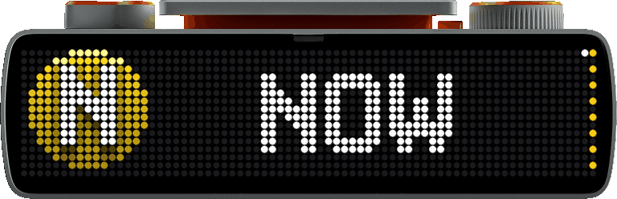
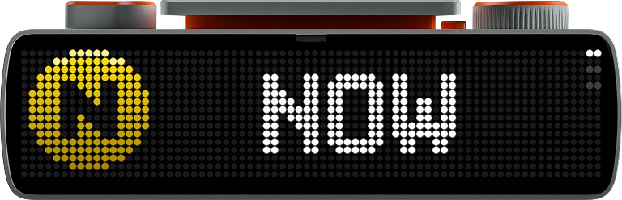
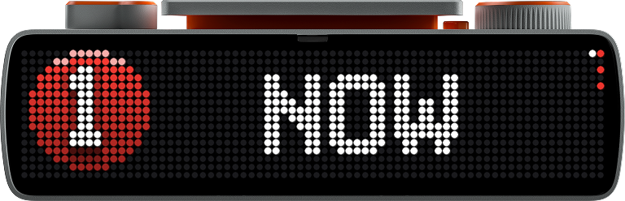
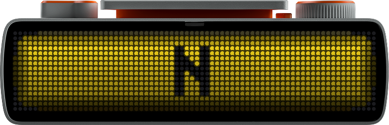
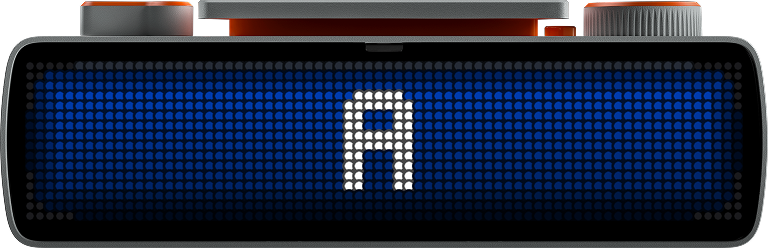

# NYC Subway for BUSY Bar

Live next-train departures for **any NYC subway station**, on the 72×16 LED
matrix of a [BUSY Bar](https://busy.app). Pick a station, a direction, and
(optionally) lines; the app shows the next train as a proper MTA route
bullet, the minutes until it leaves, and a full-screen wipe in the line's
color when it departs.

<p align="center">
  
</p>

<p align="center"><em>Everything in this README that looks like the display is the display —
real frame dumps off the hardware, re-rendered LED-for-LED into the official
BUSY Bar device art (geometry per the community gallery's device frame).</em></p>

- **Whole-system coverage** — 1–7, A–Z, shuttles, Staten Island Railway.
  Route bullets and departure animations are **generated at startup** for
  exactly the routes your station serves: official MTA line colors, glyphs
  from the BUSY Bar's own pixel fonts, the same shading treatment on every
  line.
- **Live GTFS-realtime** straight from the MTA. No API key, no account.
- **Tiny footprint** — `requests`, plus `websockets` for the dial. The
  GTFS-realtime protobuf is decoded by a ~60-line field walker; the PNGs
  and compiled `.anim` files are produced by ~150 lines of stdlib.

<p align="center">
  
</p>

<p align="center">
  
  
</p>
<p align="center">
  
  
</p>

## Install

### busybar-manager (recommended)

The app is submitted to the community
[busybar-apps gallery](https://github.com/maxswinkels/busybar-apps); once
merged it installs from the manager's **Library** tab. Until then (or
instead), add this repo as a library source — it uses the same layout:

```
POST /api/_manager/library/repos   {"repo": "Pranav-Karra-3301/busybar-nyc-subway", "branch": "main"}
POST /api/_manager/library/install {"slug": "nyc-subway"}
```

Then configure stations as **variations** — each variation carries its own
environment, so switching stations is one click in the dashboard:

```
PUT /api/_manager/apps/nyc-subway/variations/canal-st
  {"args": {}, "env": {"STATION": "Canal St", "DIRECTION": "uptown", "ROUTES": "N,Q"}, "priority": 30}
PUT /api/_manager/apps/nyc-subway/variations/greenpoint
  {"args": {}, "env": {"STATION": "Greenpoint Av", "DIRECTION": "downtown"}, "priority": 30}
```

### Bare Python

```sh
pip install requests websockets   # websockets = the dial, over USB
python apps/nyc-subway/app.py --station "Bedford Av" --direction downtown
```

The app finds the Bar by itself: USB (`10.0.4.20`) → Wi-Fi LAN
(`BUSYBAR_WIFI_URL` + `BUSYBAR_WIFI_TOKEN`) → cloud
(`BUSYBAR_CLOUD_TOKEN` from [cloud.busy.app](https://cloud.busy.app), scope
"BUSY Bar" — runs from anywhere). Force one with `BUSYBAR_TARGET`.

## Configuration

Everything is env vars; every var has a CLI flag that overrides it
(flags are what busybar-manager's argument UI edits).

| Env | Flag | Meaning |
|---|---|---|
| `STATION` | `--station` | Station name, fuzzily matched (`canal st`, `Times Sq`). All platforms of same-named stations merge, so multi-line stations just work. |
| `DIRECTION` | `--direction` | `N` / `S` / `uptown` / `downtown`, or a destination that appears in the MTA's direction labels (`Brooklyn`, `The Bronx`). |
| `ROUTES` | `--routes` | Optional comma filter, e.g. `N,Q`. Default: every route the station serves. |
| `STOPS` | `--stops` | Exact GTFS platform ids (`Q01N,R23N`) for full control; overrides the two above. |
| `BUSYBAR_PRIORITY` | — | Draw priority, default `1`: the board is visible when the Bar's switch is on OFF and politely refused (409) anywhere else. Set `30`+ to show over the clock. |
| `BUSYBAR_TARGET` | — | `auto` \| `usb` \| `wifi` \| `cloud` |
| `BUSYBAR_APP_NAME` | — | `application_name` override (default `nyc-subway`) — set it if you run two copies at once. |
| `BUSYBAR_WS` | — | Dial stream override: a `ws://` URI for the Bar's status socket. See [Dial from anywhere](#dial-from-anywhere). |

Discovering config values:

```sh
python app.py --list-stations greenpoint
# Greenpoint Av    G26   routes: G   N: Queens   S: Church Av
python app.py --demo     # fake-data run: renders the card and departure flash
python app.py --clear    # wipe this app's canvas off the display
```

With no configuration at all, it shows uptown departures at Times Sq-42 St.

## Behavior

- **Next train, no auto-scroll.** Two 1px columns of position dots run down
  the right edge: the right column always shows **each upcoming train's
  line color**, and the white pixel in the left column marks the departure
  on screen (up to 8 — one row per 2px of display). Over USB, the Bar's
  **dial** scrolls through arrivals; 25 s idle snaps back to the soonest.
  Running the app somewhere without the USB cable? See
  [Dial from anywhere](#dial-from-anywhere).
- The minutes digit flips exactly on minute boundaries.
- **Departure flash**: when the shown train's trip disappears from the feed,
  a compiled `.anim` sweeps the line's color across the display with the
  route letter riding it, holds, fades to black — 60 fps *on the device*, so
  it is equally smooth over USB, LAN, or the cloud relay. Trains are tracked
  by GTFS trip id across polls, so a timetable jitter doesn't fake a
  departure.
- **Polite by default.** At priority 1 the app owns the display only in the
  OFF position and 409s silently everywhere else; it keeps re-offering its
  canvas every 3 s so flipping the switch brings the board back within
  seconds.

## Dial from anywhere

The Bar serves its status WebSocket (dial + button events) **only on the USB
interface** — the Wi-Fi interface refuses the handshake and the cloud relay
rejects device tokens (firmware 1.1.1). So an app running off-cable
(busybar-manager on a server, the cloud target) is normally static.

The escape hatch: on the computer the Bar is plugged into, run

```sh
python3 tools/dial_forward.py        # forwards :8760 → 10.0.4.20:80
```

and give the remote app `BUSYBAR_WS=ws://<that machine>:8760/api/status/ws`
(with busybar-manager, put it in the variation's env). Dial events ride the
forwarded socket while draws keep flowing through whatever transport the app
connected with; arrival changes jump-cut instead of easing, because per-frame
animation over a relay stretches into mush. If the forwarding machine sleeps,
the app just falls back to static and reconnects within ~5 s of it returning.

The forwarder is a dumb TCP proxy, so the whole (auth-free) USB API rides
along — keep the port on a tailnet/VPN, never the open internet.

## The device, and how this app draws on it

The [BUSY Bar](https://busy.app) (Flipper FZCO — the Flipper Zero team) is a
productivity bar with two displays and an open HTTP API served over USB
Ethernet (`http://10.0.4.20`), Wi-Fi LAN (`X-API-Token` header), and a cloud
relay (`https://api.busy.app/busybar/*`, Bearer token):

| Display | Panel | Format |
|---|---|---|
| Front | 6.35″ **72×16 RGB LED matrix**, 60 Hz, 400 nits, adaptive brightness | 24-bit color, `#RRGGBBAA` in the API |
| Back | 1.54″ **160×80 OLED** | 4-bit grayscale (16 levels) |

Things this app leans on, learned the hard way and verified on firmware
1.1.1:

- **Draws are element lists that merge by id.** `POST /api/display/draw`
  takes `{application_name, priority, elements[]}` — text, rectangles,
  images, animations, countdowns. Re-pushing an id updates it in place;
  elements you stop pushing linger until they time out (everything here
  carries `timeout: 90`) or the app `DELETE`s its canvas. Never re-push an
  id with a different element type — the firmware rejects the draw from
  then on (the app self-heals by clearing and retrying once).
- **Priority is a gate, not a z-order.** Stock apps draw at 10, an active
  BUSY session at 90; a draw below the current owner gets
  `409 Not drawn due to low priority`. A 409 is cheap — "polite" apps just
  keep offering.
- **Custom apps don't run on the device.** Firmware apps are baked in; the
  supported pattern (per BUSY's own
  [widgets guide](https://busy.bar/how-to-make-a-busy-bar-widget-without-coding/))
  is an external script driving the display over HTTP — which is exactly
  what this is, and why [busybar-manager](https://github.com/maxswinkels/busybar-manager)
  exists to supervise such scripts.
- **Assets upload once.** PNGs and `.anim` files go to
  `/api/assets/upload?application_name=…&file=…` and live on the device's SD
  under `/ext/user_assets/<app>/`. This app names every generated file with
  a content hash (`bullet_A-1f2e3d4c.png`) and diffs against
  `/api/storage/list` first, so restarts upload nothing and art-pipeline
  changes can never collide with stale files.
- **`.anim` is the firmware's `bicycle0` container**: 40-byte header,
  named sections, per-frame RLE with identical-consecutive-frame merging —
  a 1.4 s hold costs one frame. The departure flash (~15 KiB per route) is
  compiled by a byte-compatible stdlib port of the firmware's `seq2anim.py`
  and plays device-side at 60 fps.
- **Fonts are LVGL binaries.** The device's `busy_bold_7` / `busy_bold_10`
  pixel fonts (OFL-1.1, shipped in
  [busybar-firmware](https://github.com/busy-app/busybar-firmware)) are the
  source of every route glyph: `tools/build_glyphs.py` parses the LVGL
  `head`/`cmap`/`loca`/`glyf` tables and bakes A–Z + 0–9 bitmaps into the
  app, so a generated "W" bullet is pixel-for-pixel the letter the device
  itself would draw.
- **The frame dump is BGR.** `GET /api/screen?display=0` returns base64 raw
  72×16 BGR24 — swap channels when previewing. Every image in this README
  came through that endpoint (`tools/capture_preview.py`).

## How the art is made

Three lines (N, Q, G) carry pixel art that was hand-tuned on hardware in the
apps this one grew out of — those exact bytes are embedded and used verbatim.
Every other line is generated at startup by ~150 lines of stdlib Python:

1. **Palette** — the official MTA line color expands into a 5-color ramp
   (specular, ramp top/bottom, lifted edge, bullet bottom) using factors
   fitted to the two hand-tuned palettes; letters are white, except black on
   the yellow N/Q/R/W per MTA convention.
2. **Bullet** — a 15×15 hard-edged disk (the mask lifted from the hand-tuned
   originals, so every line's bullet has the identical silhouette), 1px
   rim-following specular arc, vertical ramp, glyph stamped dead center.
3. **Departure flash** — a 72×16 shaded field with vignette and rounded
   corners, the 10px glyph centered, compiled into a 111-frame
   sweep/hold/fade `.anim`.

`tools/parity_check.py` proves the generator reproduces all six hand-tuned
N/Q/G assets **byte-for-byte** — the generated art isn't "close", it is the
same pipeline the originals came from.

## Development

```sh
python3 tools/build_stations.py --fetch   # re-bake the station directory
python3 tools/build_glyphs.py --write     # re-bake glyphs + legacy art (needs Pillow + ~/busybar)
python3 tools/parity_check.py             # byte-parity vs the legacy apps
python3 tools/capture_preview.py          # real preview.gif off the hardware
```

`apps/nyc-subway/` is a self-contained
[busybar-apps](https://github.com/maxswinkels/busybar-apps)-format app dir
(`app.py` + `manifest.yaml` + `preview.gif` + `requirements.txt`), which is
also what makes this repo directly installable as a busybar-manager library
source.

## License & attribution

Code is MIT. The redistributed BUSY pixel fonts are OFL-1.1 (TakWolf's Ark
Pixel, via Flipper FZCO's busybar-firmware); transit data is provided by MTA
New York City Transit; route symbols are MTA trademarks. Details in
[NOTICE](NOTICE). Not affiliated with the MTA or Flipper FZCO.
